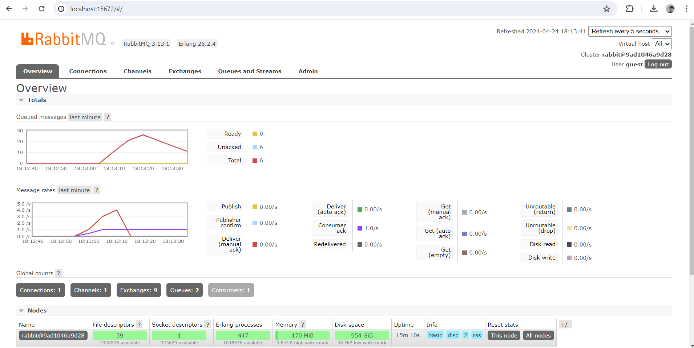

# Understanding subscriber and message broker.

- what is amqp? 

AMQP atau Advanced Message Queuing Protocol adalah protokol jaringan yang dirancang untuk pertukaran data antar sistem terisolasi. Protokol ini mendefinisikan aturan untuk format, pengiriman, penerimaan, dan interpretasi data.
AMPQ berguna untuk komunikasi antar layanan yang efisien: Memungkinkan pertukaran pesan (event, request, command) meskipun penerima tidak langsung tersedia atau terhubung.
Aplikasi terisolasi saling bertukar data: Memfasilitasi interaksi antar aplikasi di berbagai sistem.

- what it means? guest:guest@localhost:5672 what is the first guest, and what is
the second guest, and what is localhost:5672 is for? 

Dalam guest:guest@localhost:5672, guest pertama merujuk pada username default untuk akses server AMQP (biasanya dalam instalasi RabbitMQ lokal).
guest kedua adalah password yang terkait dengan username untuk autentikasi.
localhost menunjukkan server AMQP dijalankan pada mesin lokal.
5672 menunjukkan port yang digunakan server AMQP untuk menerima koneksi.

## Simulation slow subscriber

Pada beberapa waktu tertentu terdapat sampai 25 message yang tertahan. Pesan yang tertahan ini atau queued message terjadi karena adanya delay pada subscriber. Subscriber memerlukan waktu yang lebih lama dari sebelumnya untuk memperoses pesan yang diterima. Oleh karena itu terjadi penumpukan pesan saat subsciber belum bisa menanganinya. Terdapat perbedaan kecepatan pada subsciber dan publisher. Perbedaan kecepatan ini menimbulkan antrian atau queue saat kita menjalankan cargo run berulang kali yang mengirimkan pesan. Akibatnya terdapat queue yang menunjukkan penumpukan pesan yang terjadi.